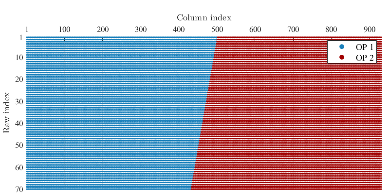

[](https://nl.mathworks.com/products/new_products/release2023a.html)

# Insights into the explainability of Lasso-based DeePC for nonlinear systems

Matlab implementation of data-driven control strategies as described in the article
"Insights into the explainability of Lasso-based DeePC for nonlinear systems."

## Prerequisites

You will need:

- `Matlab`
- `Matlab statistics_toolbox` (see https://nl.mathworks.com/products/statistics.html)
- `CVX` (see https://cvxr.com/)
- `Gurobi` (see https://www.gurobi.com/)

## Installation

To clone this repository, see https://nl.mathworks.com/help/simulink/ug/clone-git-repository.html

## Benchmark case study: the unbalanced disk

This system is described by the following difference equation

```math
\begin{equation}
        \ddot{y}(t)=\alpha_{1}\cos{(y(t))}+\alpha_{2}\dot{y}(t)+\alpha_{3}u(t),
\end{equation}
```
being $y_t$ and $u_t$ the angular position and the input voltage, respectively. 

Toward an explainable Lasso-based DeePC, we construct a two-blocks Hankel matrix by utilizing the (raw) input/output data gathered around the system's operating points (OPs) and stored in [`data`](data).

<p align="center">
  
</p>

The following gif showcases the reference tracking performed by a Lasso-DeePC formulation with the above data structure.

<p align="center">
     
</p> 

## License
This project is licensed under the terms of the `CC-BY-4.0` license.
See [LICENSE](LICENSE) for more details.


## References
-
